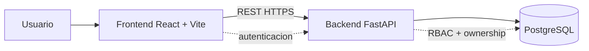
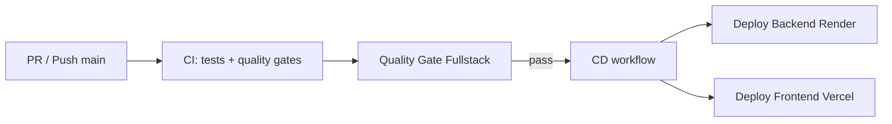

# Presentacion 5 Minutos - Universidad Digital

## Slide 1 - Problema y solucion

Universidad Digital centraliza la gestion academica en una plataforma web con acceso por roles.

- Admin: gestiona catalogo y operacion
- Docente: registra y consulta calificaciones
- Estudiante: consulta su informacion academica

---

## Slide 2 - Arquitectura general

Mensaje clave: arquitectura separada por capas para escalar frontend, backend y datos de forma independiente.

---

## Slide 3 - Backend por dominios

Dominios principales:

- users, roles
- subjects, periods
- enrollments, grades
- dashboard, teacher_assignments

Patron de cada dominio:

- models.py
- schemas.py
- services.py
- routes.py

Mensaje clave: mantenibilidad alta por separacion de responsabilidades.

---

## Slide 4 - Pipeline CI/CD

Quality gates:

- cobertura backend/frontend
- mantenibilidad
- estabilidad y performance
- observabilidad

---

## Slide 5 - Entornos y despliegue

- Local: Docker Compose con frontend, backend y PostgreSQL.
- Cloud: backend en Render, frontend estatico en Vercel/Render, DB gestionada en Render.
- Variables por entorno para evitar cambios de codigo.

Resultado: mismo flujo funcional en local y produccion.

---

## Slide 6 - Resultado y siguiente paso

Logros:

- Plataforma full stack funcional
- Seguridad por roles y sesion segura
- Calidad automatizada antes de despliegue

Siguiente paso:

- consolidar evidencia de CI/CD dentro del repositorio en una carpeta de arquitectura/versionado.
