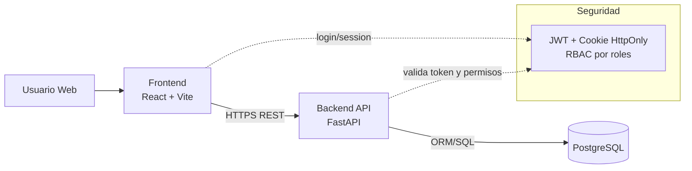
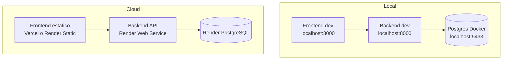
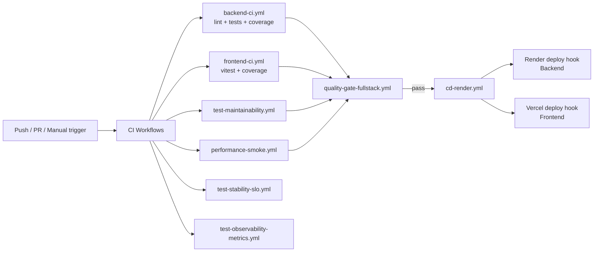

# Presentacion Proyecto Universidad Digital

## Slide 1 - Titulo

Universidad Digital: arquitectura general del sistema y pipeline CI/CD.

- Frontend: React + Vite + TypeScript
- Backend: FastAPI (Python)
- Base de datos: PostgreSQL
- Calidad y despliegue: workflows CI + CD a Render/Vercel

---

## Slide 2 - Objetivo de arquitectura

Mostrar como se conectan los componentes para soportar:

- autenticacion y autorizacion por roles
- operaciones academicas (usuarios, materias, periodos, inscripciones, notas)
- trazabilidad de calidad antes de despliegue
- despliegue continuo a entornos productivos

---

## Slide 3 - Diagrama general del sistema

Mensaje clave:

- El frontend concentra experiencia de usuario y consumo API.
- El backend centraliza reglas de negocio y seguridad por rol.
- PostgreSQL mantiene consistencia transaccional de datos academicos.

---

## Slide 4 - Capas del backend (por dominios)

Estructura por dominio con separacion de responsabilidades:

- users
- roles
- subjects
- periods
- enrollments
- grades
- dashboard
- teacher_assignments
- auth/core (cross-cutting)

Patron repetido por dominio:

- models.py
- schemas.py
- services.py
- routes.py

---

## Slide 5 - Flujo funcional extremo a extremo

1. Usuario inicia sesion en frontend.
2. Backend valida credenciales y emite token/sesion.
3. Frontend llama endpoints protegidos segun rol.
4. Backend aplica RBAC + reglas de ownership.
5. Backend persiste/consulta en PostgreSQL.
6. Frontend renderiza vistas por rol (admin, docente, estudiante).

---

## Slide 6 - Entornos y despliegue de runtime

---

## Slide 7 - Pipeline CI/CD (vision ejecutiva)

Nota para exposicion:

- En este workspace no aparecen los archivos de `.github/workflows`,
  pero si estan referenciados en documentacion de estrategia/traceabilidad.

---

## Slide 8 - Controles de calidad y riesgo

Quality gates principales:

- Coverage backend/frontend
- Mantenibilidad de tests
- Performance smoke/full
- Estabilidad (flake rate objetivo <= 2%)
- Observabilidad de tendencias
- Compatibilidad de contrato OpenAPI

Decision release:

- Si falla gate Fast en PR: no merge.
- Si falla gate Full en main/release: estado NO-GO.

---

## Slide 9 - Beneficios de la arquitectura actual

- Escalabilidad modular por dominios
- Seguridad centralizada (JWT, cookies HttpOnly, RBAC)
- Menor riesgo en produccion por quality gates automatizados
- Despliegue desacoplado frontend/backend
- Trazabilidad completa requisito -> test -> evidencia CI

---

## Slide 10 - Roadmap sugerido

1. Consolidar workflows CI/CD dentro del repo para auditoria directa.
2. Agregar diagrama C4 (Context + Container) versionado.
3. Integrar observabilidad de app (latencia/errores) con alertas.
4. Definir DORA metrics para medir throughput y estabilidad.

---

## Backup slide - fuentes del proyecto

- README raiz
- backend/READMEv3.md
- docs/CI_LOCAL_REPRO_GUIDE.md
- docs/TEST_EXECUTION_STRATEGY_FAST_FULL.md
- docs/TEST_TRACEABILITY_MATRIX.md
- docker-compose.yml
- render.yaml
