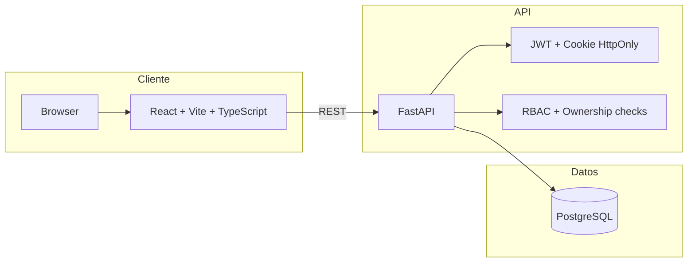
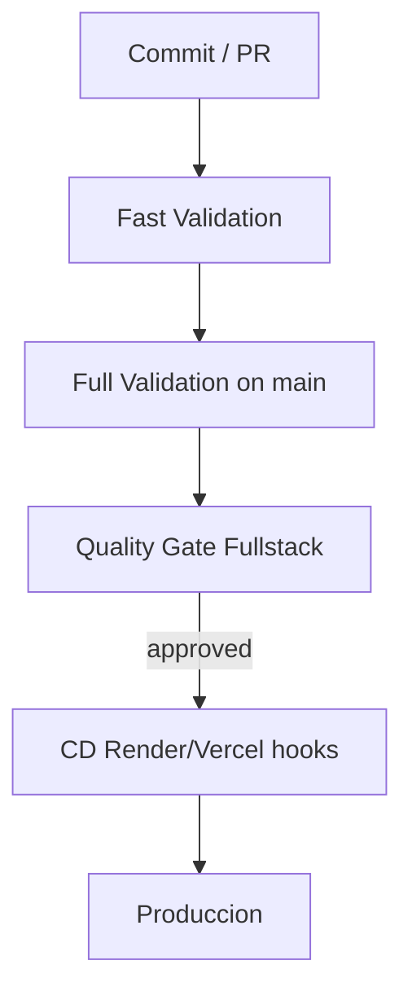

# Presentacion Jurado Tecnico - Universidad Digital

## Slide 1 - Alcance tecnico

Sistema academico full stack con separacion frontend/backend, persistencia relacional y pipeline de calidad continua.

Objetivos:

- seguridad por rol y ownership
- trazabilidad requisito -> prueba -> gate
- despliegue continuo con control de calidad

---

## Slide 2 - Arquitectura de contenedores

Puntos tecnicos:

- tokens en memoria frontend
- validaciones de autorizacion en capa service/dependencies
- contratos API centralizados en backend

---

## Slide 3 - Diseño del backend por dominios

Estructura por bounded context funcional:

- users, roles
- subjects, periods
- enrollments, grades
- dashboard

Patron aplicado en cada modulo:

- modelado de datos
- contratos de entrada/salida
- reglas de negocio en services
- exposicion HTTP en routes

Ventaja: reduce acoplamiento y facilita pruebas unitarias e integracion por modulo.

---

## Slide 4 - Calidad y validacion continua

Estrategia Fast/Full con workflows especializados:

- backend-ci: lint + unit/integration + coverage
- frontend-ci: vitest + coverage
- maintainability: complejidad y duplicacion
- performance-smoke
- stability-slo (flake rate)
- observability-metrics
- quality-gate-fullstack como gate de merge/release

Regla:

- PR: feedback rapido con gate obligatorio
- main/release: validacion full + criterio GO/NO-GO

---

## Slide 5 - CI/CD y release

Controles de release:

- cobertura
- estabilidad <= 2% flakiness
- contrato API sin breaking changes
- artefactos de observabilidad y performance

---

## Slide 6 - Riesgos, mitigacion y roadmap

Riesgos:

- divergencia entre documentacion CI y workflows reales presentes en repo
- crecimiento de deuda de pruebas e2e

Mitigaciones:

- versionar diagrams + arquitectura como codigo
- unificar fuente de verdad de pipeline en carpeta dedicada
- dashboard de tendencias de calidad por release

Roadmap:

1. C4 model (Context, Container, Component).
2. SLO/SLA de API y alertas operativas.
3. DORA metrics para madurez DevOps.
